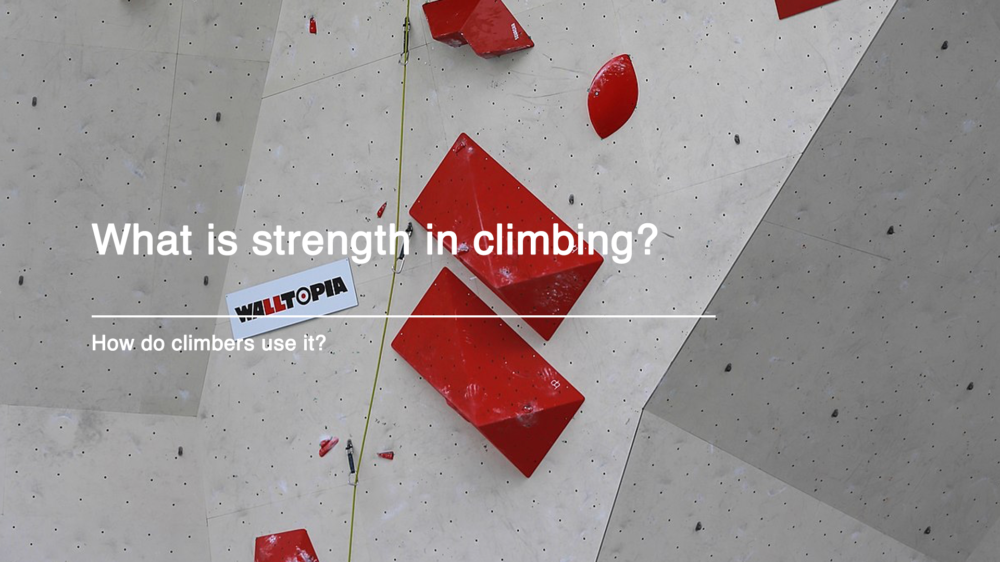

# WHAT IS STRENGTH IN CLIMBING?

<!-- ### Are climbers getting stronger or are there more strong climbers? -->

By David Malary 

Project links: 
- [project link](https://madhat5.github.io/project-repo/) 
- [project repo](https://github.com/madhat5/MSDV_2021-Thesis)

#### Abstract
------
As I’ve delved into climbing, both in practice and research, one thing has quickly become apparent: the continuous effort to get stronger. As I began to look into this further, and developed questions about climbing benchmarks around the world, as well as the rate of strength increase of climbers, I focused my research on two questions: have we as climbers gotten stronger over time, or are there more strong climbers (or both)? Our treatment for this thesis will attempt to answer these questions by understanding what strength is in climbing. We will focus on bouldering. We will analyze several aspects of climbing, including what the records and benchmarks are for climbing routes, what the various grading systems are (how climbs are measured); what makes a climb hard; how climbers get stronger; and other aspects such as the increase in popularity of the sport over time, and accompanying research and literature. As we work on answering the aforementioned questions, we will work to expand the reader’s climbing knowledge throughout this project.

#### Preview
------

<!-- #### Presentation
------
 -->

#### Acknowledgements
- The GP81 family
- The New School
------